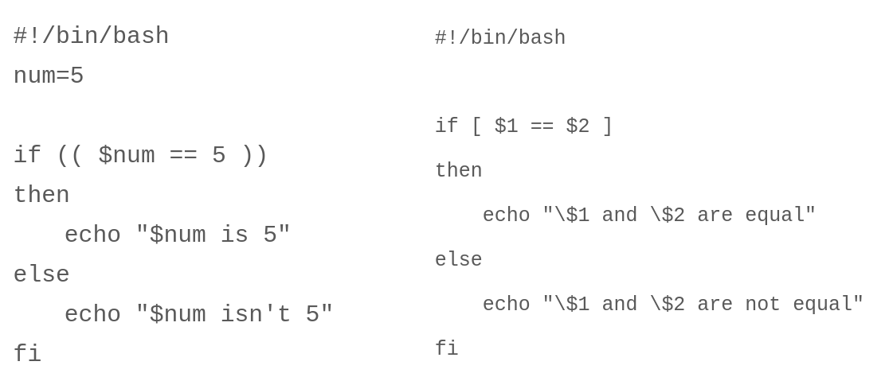
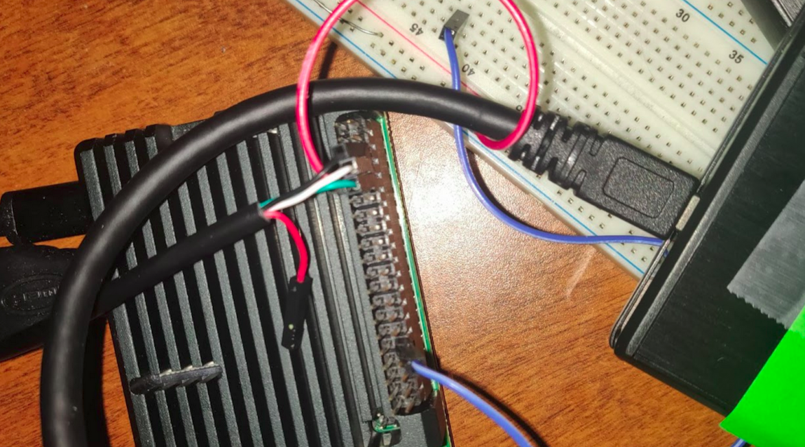

# Linux Tips
Cool stuff

---

# How can I, a regular citizen, install Linux
- Flash image to USB and boot
- Dual booting
- VM is an option
- Some devices ship with linux by default (not many)

---

# Quick CLI Review
ls - list the files in current directory
cd - change current directory
mkdir - make a new directory
nano - open nano editor
touch - create a file or update its modification time
chmod - change access permissions
rm - remove (permanently delete) a file 
rmdir - remove a directory
pwd - print working directory

---

# CLI tips
- !!
  - replaced with last command
- !$
  - Replaced with last argument of last command
- cd -
  - cd back to the previous location you were
- man
  - read manual for a command
  - man -a intro (intro to linux)
- sudo
  - run command as root
  - sudo !! (run previous command as root if you forgot sudo)

---

# Keyboard Shortcuts
- Ctrl+C → kills running program
- Ctrl+Z → pauses running program
- Ctrl+D → send EOF
- Ctrl+S & Ctrl+Q → start & stop text stream
- Ctrl+R → to search for previous commands (fuzzy finder)
- Ctrl+W → erase current word up to cursor
- Ctrl+V → verbatim input

---

# Useful tools
- Text Editor
  - Nano or even vim
- Cscope
  - Tool for browsing source code 
- Man
  - Read the docs (manual) for every BASH command/C library

---

# sed - a text processing utility - Stream EDitor

---

# sed
$ sed -i -e ‘s/ \*\$//’ -e ‘s/[[:space:]]\*\$//’ -e ‘/^\$/d’ file.sh
1. Delete all spaces at the end of every line in a file
2. Delete all tabs at the end of every line in a file
3. Delete all empty lines in a file
^ is the beginning of a line
$ is the end of a line

---

# vim/cscope - text based search utility
- cscope -R (in a parent directory to create a cscope database)
- CTRL+D (to exit when the database is generated)
- Open vim in the directory where cscope.out resides and you can search for text within the tree
- Using cscope you can traverse the files that include the text you searched for

---

# grep - command line util to find text
You can pipe the output of a command into grep or give a path to an input file
dmesg | grep "text"    or    grep "text" file.sh
If you want to find file.txt in your home directory
ls ~ | grep file.txt #not entirely correct
. → any character in regex
ls /home | grep -F file.txt #-F means no regex, just text 
^ → start of line
$ → end of line

---

# awk - a text processing utility

---

# Basic Scripting

---

# Quick Variable Review
$0...9 - $0 is filepath of the script and \$1...9 are the arguments
\$\# - the number of arguments
\$@ - an array of arguments
\$\? - process’ exit code

---

# Arithmetic Operations
x=1
z=2
\$x+\$z #3
\$z-\$x #1
\$x*\$z #2
\$z/\$x #2
\$x%\$z #1
[ $x == $z ] #false
[ $x != $z ] #true

---

# Relational Operations
x=1
z=2
[ $x -eq $z ] \#false (they aren’t equal)
[ $x -ne $z ] \#true (they are unequal)
[ $x -gt $z ] \#false (x is not greater than z)
[ $x -lt $z ] \#true (x is less than z)
[ $x -ge $z ] \#false (x is not greater than or equal to z)
[ $x -le $z ] \#true (x is less than or equal to z)

---

# Boolean Operations
x=1
z=2
[ ! true ] #false
[ $x -gt $z -o $x -ne $z ] \#true
[ $x -ne $z -a $x -lt $z ] \#true

---

# String Operations
x="1"
z="2"
[ $x == $z ] \#false
[ $x != $z ] \#true
[ -z $x ] \#false (“1” is not of length zero)
[ -n $x ] \#true (“1” is of length non-zero)
[ \$x ] \#true (\$x is not an empty string)

---

# File Operations
file=”secrets.txt”
$ ls -l secrets.txt
--w------- 1 kdlp kdlp 106 Aug 22 04:01 secrets.txt
[ -d \$file ] \#false (\$file is not a directory)
[ -f \$file ] \#true  (\$file is a regular file)
[ -r \$file ] \#false (\$file is not readable)
[ -w \$file ] \#true  (\$file is writable)
[ -x \$file ] \#false (\$file is not executable)
[ -s \$file ] \#true  (\$file has size greater than zero)
[ -e \$file ] \#true  (\$file exists)

---

# Getting set up
$ touch file.sh
$ chmod 744 file.sh (chmod changes the permissions that people have for this file)
-rwxr--r-- (new permissions after chmod, now you can execute file.sh)
r: read w: write x: execute
$ ls -l
Run ^ to check permissions in cwd
First permissions index is a directory marker
Then 1-3: owner permissions 4-6: group permissions 7-9: other user permissions

---

# Getting set up
To write a bash script you can execute direction, you will need to include a shebang line to indicate that bash should be used to interpret the program
On the first line you write \#!/bin/bash
Now you can use all commands you can use in your CLI in combination with conditionals, loops, and more

---

# Command-line Arguments
You can reference the arguments passed to your script with \$i where i is the index of the argument when the script is run
\$ ./script.sh dog cat
\$0 \#./script.sh
\$1 \#dog
\$2 \#cat

---

# If statements: integers and strings

---

# Loops

---

# Functions
Functions in a bash script are declared with
foo(){...}
or 
function foo(){...}
Function arguments come after calling the function, like passing arguments to a script e.g. foo arg1 arg2 ...
Within foo() → $1=arg1, $2=arg2, ...

---

# A && echo "true" || echo "false"
‘echo true’ fires if the prior command succeeds (echo $? = 0)
‘echo false’ fires if the prior command fails
What is echoed?

---

# Debugging / Accessing Linux systems

---

# Remote Access
- Cockpit 
  - https://your.computers.ip.addr:9090
- ssh
  - Is often enabled by default
  - Setup ssh keys so you can log in without a password

---

# TTL cable
- Used to connect to serial console ports
- Microcontrollers, Raspberry Pi, WiFi routers ...  
- Useful for low level debugging
- DO NOT HAVE THE TTL RED WIRE AND USBC POWER SOURCE PLUGGED IN AT THE SAME TIME
  - YOU WILL FRY YOUR RPI
[purchase](https://www.adafruit.com/product/954)

---

---

---

# Tracing and bpftrace
- Tracing is most often used for debugging purposes. In the kernel, debugging can become overwhelming without the proper tools.
- bpftrace is a tracing language which relies on the Linux BPF system and built-in Linux tracing capabilities, such as: kprobes(kernel level), uprobes(user-space level), and tracepoints
- Which are all types of breakpoints in a stream of processes

---

# Tracing and bpftrace
- Some programmer determined action can be performed at these breakpoints, using bpftrace
- Refer to [https://github.com/iovisor/bpftrace/blob/master/docs/tutorial_one_liners.md](https://github.com/iovisor/bpftrace/blob/master/docs/tutorial_one_liners.md) 
- For a bpftrace tutorial and reference guide
